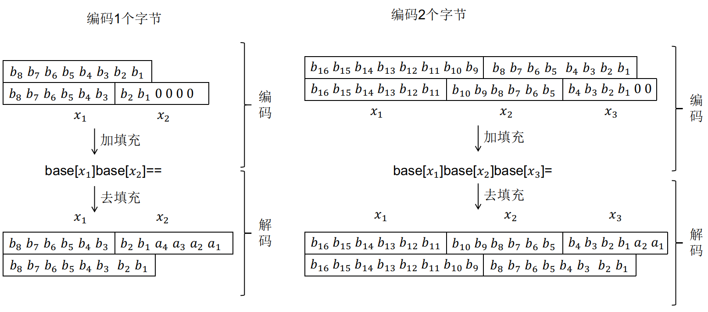

# Decode_The_File

## 解题思路

> 下载附件,里面有很多base64编码字符,解码后得到一个py文件,分析了一波,没啥价值信息.

> base64编码和解码原理如下:

> 在这里,说明加密后的填充位0,解码过程中,即使当$a_i$不为0时解码过程也能正确进行.那么也就是可以使用$a_i$传递一些信息.因此,将编码中的$a_i$提取出来

## flag

> ROIS{base_GA_caN_b3_d1ffeR3nT}