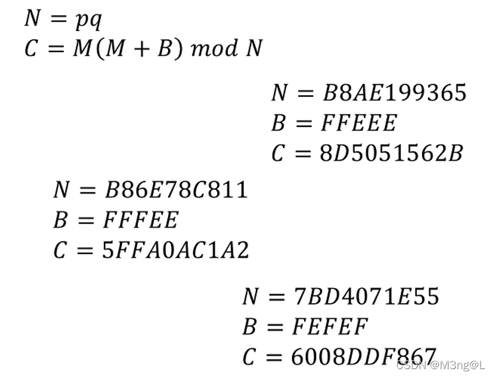
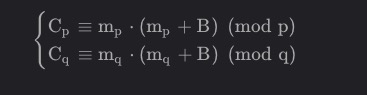

# Decrypt-It-easy 

## 解题思路

> 下载附件后,得到了3个文件,有一个二进制文件,一个使用文件,一个加密后的文件.

> 反编译rnd文件,得到主函数,发现原来的文件数据与rand()生成的随机数异或,并且使用了srand()设置种子,并且种子seed = time(0),相当于当时的时间（是格林尼治时间1970年1月1日00:00:00到当前时刻的时长,时长单位是秒）

> 由于rand()函数的性质,只要seed一致,rand()生成的随机数就是一样的,也就意味着我们可以借此恢复原文件数据（只要随机数与此时已知的ecrypt1.bin文件数据相异或即可）

> 那么首先要找到当时的时间,而实际上ecrypt1.bin就是通过这样的加密过程生成的,那么文件的生成时间一定是当时作为seed的值,可以通过linux命令stat;得到

```
最近访问：2022-03-23 20:17:39.817896184 +0800
最近更改：2014-11-22 22:46:30.000000000 +0800
最近改动：2022-03-23 20:17:34.565896062 +0800
```

> "最近更改"时间,需要将此时间转换为时间戳的形式,

```
import time
t = "2014-11-22 22:46:30"
#转换成时间数组
timeArray = time.strptime(t, "%Y-%m-%d %H:%M:%S")
#转换成时间戳
timestamp = time.mktime(timeArray)
#1416667590.0
```

> 最后代入解密脚本即可（由于使用的是c语言的rand()函数,如果是使用其他语言的随机数生成函数,可能是使用的不同的生成随机数算法,导致生成的随机数不同）

> 由于原来的加密程序是elf,也即是linux系统下执行的加密过程;所以我们需要在linux编译这个解密脚本（windows下编译此脚本生成的exe无法使用）

```
gcc decode.c -o decode
decode ecrypt1.bin output.png 1416667590.0
```

> 得到png图片



> 发现这里的N相对很小,可以直接找在线网站进行分解,也就已知三对p,q;而N这么小,可以猜测所加密使用的m也很小,那么就意味着flag被拆开成了三部分的较小的m

> 由于加密过程完全没有按套路出牌（可能有相关论文介绍这种加密的解密方式,但是没有找到）,既然N这么小,并且p,q也已知,可以尝试爆破

> 直接在模N的情况下爆破是困难的,因为N已经达到了2<sup>38</sup>左右,是不可能进行爆破的（也就是遍历在该模数情况下的所有值）

> 那么可以减小模数,将N换做p,q作为模数,因此把原来三个同余式转换为六个同余式;那么又由于原来三个同余式所加密的明文不同,需要分开考虑解密,也就是将两个同余式解密



> 其中C<sub>p</sub>代表在模p情况下的C,同理m<sub>p</sub>

> 当然这里的所有B都是小于p,q的,所以不用在原来的基础上模p,q

> 那么由于p,q是较小的,已经小于2<sup>20</sup>了,完全可以进行爆破（遍历该模数下所有的值,找出满足以上同余式的值）

> 找到之后就可以构造出


> 同余式右侧数值以及模数已知,我们可以使用中国剩余定理（CRT）求解同余式方程组的根

> 由于可能有多个值满足条件,最后的结果转换为字节类型,观察是否是flag的格式即可判断筛选

## flag

> SECCON{Ra_b1_N}

## 参考

> https://blog.csdn.net/qq_51999772/article/details/123699244