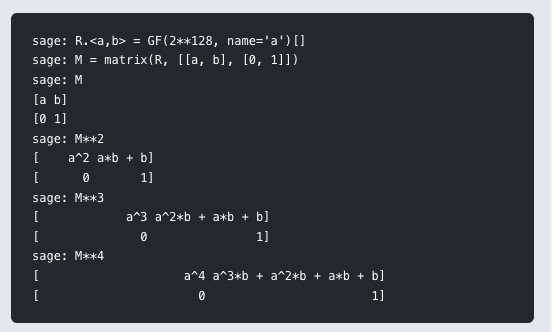

# Onetimepad2

## 解题思路

> 下载附件,得到一些加密字符串和一个加密的py脚本

> 分析函数process(m,k):

```
def process(m, k):
    tmp = m ^ k
    res = 0
    for i in bin(tmp)[2:]:
        res = res << 1;
        if (int(i)):
            res = res ^ tmp
        if (res >> 256):
            res = res ^ P
    return res
```

> res = res << 1代表乘以x,多项式的系数全体左移一位

> if (int(i)):res^=tmp等价于res^=int(i)*tmp,代表+𝑡<sub>𝑖</sub>⋅𝑓<sub>𝑡</sub>

> if (res>>256):res^=P代表模本原多项式g

> 综上,process(m,k)实际上实现了𝐺𝐹(2<sup>256</sup>)上的元素𝑚与𝑘之和的平方(𝑚+𝑘)<sup>2</sup>

> 解密过程:


𝑘<sub>2</sub>=(𝑘<sub>1</sub>+𝑠𝑒𝑐𝑟𝑒𝑡)<sup>2</sup>,𝑘<sub>3</sub>=(𝑘<sub>2</sub>+𝑠𝑒𝑐𝑟𝑒𝑡)<sup>2</sup>
(在GF(2<sup>256</sup>)上的运算)

𝑐<sub>1</sub>=𝑚<sub>1</sub>⊕𝑘<sub>1</sub>,𝑐<sub>2</sub>=𝑚<sub>2</sub>⊕𝑘<sub>2</sub>,𝑐<sub>3</sub>=𝑚<sub>3</sub>⊕𝑘<sub>3</sub>
,其中𝑐<sub>i</sub>(𝑖=1,2,3),𝑚<sub>i</sub>(𝑖=1,2)
已知

则𝑘<sub>2</sub>=𝑚<sub>2</sub>⊕𝑐<sub>2</sub>,𝑘<sub>3</sub>=𝑚<sub>3</sub>⊕𝑐<sub>3</sub>
,可解出secret：𝑠𝑒𝑐𝑟𝑒𝑡=𝑘<sub>3</sub><sup>1/2</sup>+𝑘<sub>2</sub>
(在GF(2<sup>256</sup>)上的运算)

接下来解出𝑘<sub>1</sub>
：𝑘<sub>1</sub>=𝑘<sub>2</sub><sup>1/2</sup>+𝑠𝑒𝑐𝑟𝑒𝑡
(在GF(2<sup>256</sup>)上的运算)


> 以上是onetimepad题目加密的做法,这道题目依然用到了上面的知识.

> process1(m,k)是一个乘法GF(2^128).仔细观察process2可以发现它只是两个2×2矩阵的乘法.

> nextrand做什么？它实现了一个快速的指数运算.nextrand(rand) = M^N [0,0] . rand + M^N [0,1],而且N也更新为N^2.使用的M^N值是多少？象征性地看一下M的幂：



> 第一个条目只是一个A^N,第二个条目等于B(A^(N-1)+A^(N-2)+...+1) = B(A^N -1)/(A-1),因此,我们有以下方程式：

> 这里N是未知的,但不能直接求解.先解一个^N,然后解一个离散对数问题.

> 把第二个方程乘以（A-1）

> 因此可以计算A^N.要得到N,需要计算GF（2^128）中的离散对数.有次指数算法,所以128位的大小是相当实用的.实际上,sage可以在几分钟内完成：

## flag

> flag{LCG1sN3ver5aFe!!}