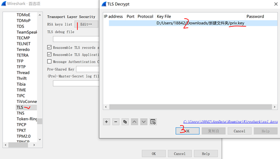

# Root

## 解题思路

> 下载附件,得到pcap流量包,打开只有https流量,看来是要恢复https流量了.

> 在第4个数据包内找到了流量协议的加密方式RSA：


> 接下来开始寻找rsa的相关内容,在第11个数据包内发现了RSA的pubkey信息：


> 将公钥内容导出(右键->复制->复制为16进制),得到

```
n= 119514949101869418903318873112867362646835071069241106524305309393065463453656568774743760570131693630159578791023971219610889380592598543536351234572467281587006324435481617535146537233169791976943380665697114009764947413190424965605151568078201516319476934559728328089096265594820785319942352507655193149106742096711100954500911687865197173709176323170965183162767042434738106978751911965481346436431672573623281881734153294758147557422163198312359915688282919868328721978258906227136067834058632472297370857579705187167410321575782375360591482072103305682978126915060591553714123014075758332542543138964874724542072396937584280625337262888775332970921021304750133076287918708895881009630077473404974677880966925170111450054682589858406625668247502091263399827525224215993035344424566568011928443888310172591327112851125472052921219080258671669993973898127049957265386657286586085405099815473365810806674154776699651214819118383817272562813199977233417411126959716068072338393084310289588450441128514416597910759814182527294940228828417785903441042114817369303389645545333054503129561885740632378715731405799144085706505382819066670726261358910837171602305916072912729756717338147737273166145500948558122541808933901885205278570148809

e=31337
```

> 然后在线分解n得到p和q,并使用rsatool.py(https://github.com/ius/rsatool)生成私钥：

```
python3 rsatool.py -p 345709341936068338730678003778405323582109317075021198605451259081268526297654818935837545259489748700537817158904946124698593212156185601832821337576558516676594811692389205842412600462658083813048872307642872332289082295535733483056820073388473845450507806559178316793666044371642249466611007764799781626418800031166072773475575269610775901034485376573476373962417949231752698909821646794161147858557311852386822684705642251949742285300552861190676326816587042282505137369676427345123087656274137257931639760324708350318503061363031086796994100943084772281097123781070811610760735943618425858558459014484742232019973 -q 345709341936068338730678003778405323582109317075021198605451259081268526297654818935837545259489748700537817158904946124698593212156185601832821337576558516676594811692389205842412600462658083813048872307642872332289082295535733483056820073388473845450507806559178316793666044371642249466611007764799781626418800031166072773475575269610775901034485376573476373962417949231752698909821646794161147858557311852386822684705642251949742285300552861190676326816587042282505137369676427345123087656274137257931639760324708350318503061363031086796994100943084772281097123781070811610760735943618425858558459014484742232018933 -e 31337 -o priv.key
```

> 然后将生成的私钥(priv.key,注：因为p,q顺序不一定,因此会生成2个不同的私钥,但是不影响,哪个私钥都可以)导入到流量包中(编辑->首选项->Protocols->TLS->RSA keys list)：



> 此时再追踪TLS流看一下：


> 很明显,我们发现了一个钥匙的形状,并且结尾处有一串16进制字符串,将该16进制串转为字符串,得到flag

## flag

> when_solving_problems_dig_at_the_roots_instead_of_just_hacking_at_the_leaves