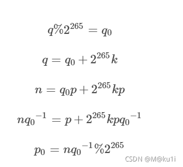

# Rsarsa

## 解题思路

> 下载附件,得到一个sage文件,后缀改成python,开始分析代码

```
p1=p>>724  # 相当于p的高300位是p1
q0= q % (2 ** 265) # 相当于q的低位是q0
```
> 已知p的高位,要求p的低位p0,然后和p的高位组装就得到了p.p0的计算公式如下

```
p0=n*invert(q0,mod)%mod # 也就是ct的值,计算过程见下图
```



> 高位攻击具体代码如下

```
pbar=(p1<<724)+ct
PR.<x> = PolynomialRing(Zmod(n))
for i in range(32):
    f=pbar+x*mod*32
    f=f.monic()
    pp=f.small_roots(X=2^454,beta=0.4)
    if(pp):
        break
    pbar+=mod
assert pp
p=pbar+pp[0]*32*mod
```

> 求出p后根据n求出q,最后就可以解出m

## flag

> flag{d0071665-7786-421e-5714-78df225cc7ef}

## 参考

> https://sagecell.sagemath.org

> https://blog.csdn.net/weixin_56678592/article/details/120657746
