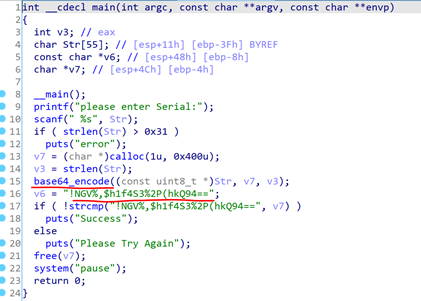
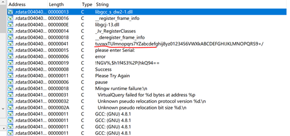
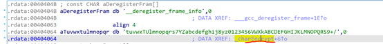
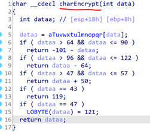

# 消失的岛屿

## 解题思路

> 下载附件,得到一个exe文件,看雪系列,看来是要ida分析了.

> ida32打开,查看main函数

> 明显的base64加密,shift+f12查看base64字符串

> 看起来是个魔改的base64码表,但题目提示不是真是的编码表,双击来到引用“魔改base64码表”的函数charEncrypt

> 也很明显,charEncrypt对程序中已经魔改后的base64码表进行了又一次加密变换,加密后的结果应该是最终的魔改base64编码表了

## flag

> flag{KanXue2019ctf_st}

