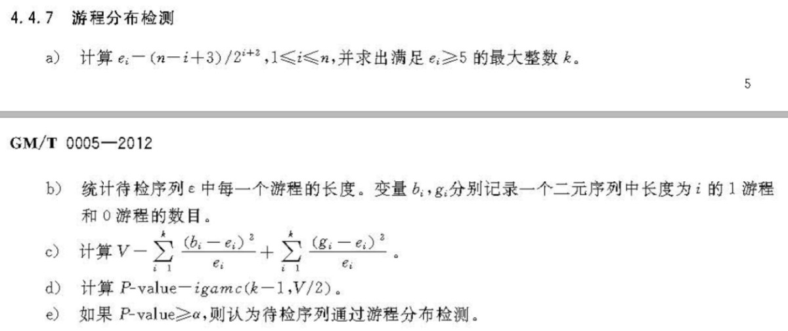
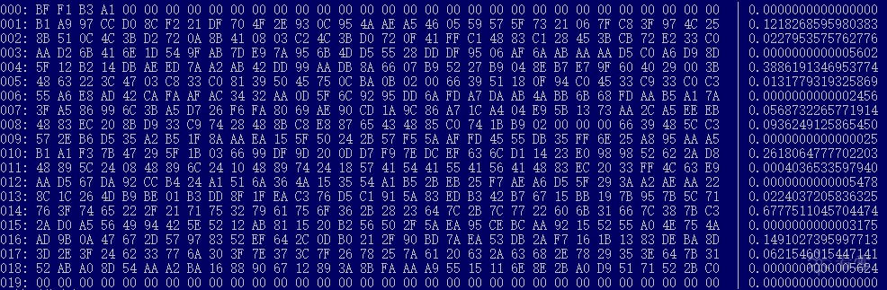

# 部落冲突

## 解题思路

> 下载附件,exe文件,看雪CTF系列.

> "部落冲突"是一个模拟实战环境的CM.模拟场景：攻击者得到了一组授权后,通过观察分析,使用相关技术推算得到另一组授权."部落冲突"是"七十二疑冢"的升级作品.

> "七十二疑冢"考验的是攻击方的CRC算法能力.它选用了CRC校验作为基本运算,而CRC函数(在多项式意义下)是线性运算的,从而使得"七十二疑冢"能被高效破解.为了进一步提高难度,"部落冲突"采用了哈希函数作为作为基本运算,而序列号就是依次序改变哈希函数种子的下标.算法如下：

```
上一轮种子经过哈希函数生成的散列值(256bit),叠加上由序列号指定的常向量(给定256个向量,每个向量256bit)计算出本轮迭代值,作为下一轮哈希的种子.
```

> 按照这样的规则迭代下去,直至穷尽序列号.如果最终计算结果得到全0序列(256bit),即为破解成功.或者说,要想正面攻克部落冲突本质上就是一个寻找弱碰撞的过程,其穷举难度很大.如果把破解思路安排在hash碰撞上,太没意思,而且也是违规的.

> 作者安排的正确解法是什么呢？"部落冲突"模拟了一个正版软件.假设攻击方花钱购买了这个软件,并获得了一个(以狂场为用户名的)正确序列号,然后这个攻击者想求出另外一个用户(用户名为"你")的正确序列号.上述计算过程被包装成一个名为"部落冲突"的游戏.要求解的序列号就是"你"的走位,只有成功躲开所有射击(中0箭)才能活着走出战阵(破解成功).而"你"不是唯一的玩家.游戏中已经有一名叫做"狂场"的通关玩家,并且题干中已经显式给出了他的走位(已知一组正确序列号).

> 通过分析"狂场"的走位,发现其中暗藏的规律,应当可以得到解题思路.分析过程如下：

```
1) 观察狂场的走位,序列号本身并无特殊规律 --> 解题线索蕴藏于走位过程中

2) 游戏的流程是单向进行的,每一轮迭代值由哈希算法迭代生成,不可逆推或跳过 --> 必须一步一步跟踪迭代结果

3) 脱壳后最先可以看到256*256bit的向量表,看起来数据随机毫无规律(但作者是有机会在其中精心构造数据的) --> 作为用来叠加到散列值的向量,不太可能单独成为解题线索,所以攻击者不能抛开哈希函数和散列值单独分析向量表

4) 哈希函数得到怎样的散列值,对于出题者来说也是难以控制(预测或构造)的,同时哈希函数因其特性可以作为伪随机数生成器(或伪随机数生成器的一部分) --> 散列值应当依概率满足伪随机序列的特点,因此也不能作为作者预埋解题线索的地方

5) 结合3)、4)分析,尽管向量表和散列值都看似随机,但根据计算流程,二者的叠加结果才是真正值得分析的,作者预留的解题线索只能在这个地方

6) 如果此题的计算过程真的都是随机的,那么作者也难设计有效解法 --> 作者预埋的解题线索必然是"不随机"的
```

> 所以,分析向量表和散列值的叠加结果的随机性,是此题的解题线索.据此分析"狂场"的走位,使用经典的随机性检测方法*分别对迭代值进行随机性检测,会发现：每3步会出现一个"游程分布*"严重不随机的迭代值.

> 本题的随机性检测方法,基于 国家密码管理局发布的《GM/T 0005-2012 随机性检测规范》.具体算法如下：



> 其中：n为待检测序列长度(此题中n=256),igamc为不完全伽马函数(Incomplete Gamma Function)

> 本题中"狂场"的走位先后经过的迭代值及其游程分布检测P-value值如下：



> 第0步,初始种子,若以%s输出为"狂场"的汉字,即玩家用户名；第19步,迭代值为全0序列(中0箭,中箭支数其实就是256bit序列中有多少个1),为此题目标；

> 第3、6、9、12、15、18步(即每隔3步)所处迭代值及其游程分布检测P-value值如下：

```
{ 0xAA, 0xD2, 0x6B, 0x41, 0x6E, 0x1D, 0x54, 0x9F, 0xAB, 0x7D, 0xE9, 0x7A, 0x95, 0x6B, 0x4D, 0xD5, 0x55, 0x28, 0xDD, 0xDF, 0x95, 0x06, 0xAF, 0x6A, 0xAB, 0xAA, 0xAA, 0xD5, 0xC0, 0xA6, 0xD9, 0x8D }, // 0.0000000000005602

{ 0x55, 0xA6, 0xE8, 0xAD, 0x42, 0xCA, 0xFA, 0xAF, 0xAC, 0x34, 0x32, 0xAA, 0x0D, 0x5F, 0x6C, 0x92, 0x95, 0xDD, 0x6A, 0xFD, 0xA7, 0xDA, 0xAB, 0x4A, 0xBB, 0x6B, 0x68, 0xFD, 0xAA, 0xB5, 0xA1, 0x7A },	//  0.0000000000002456

{ 0x57, 0x2E, 0xB6, 0xD5, 0x35, 0xA2, 0xB5, 0x1F, 0x8A, 0xAA, 0xEA, 0x15, 0x5F, 0x50, 0x24, 0x2B, 0x57, 0xF5, 0x5A, 0xAF, 0xFD, 0x45, 0x55, 0xDB, 0x35, 0xFF, 0x6E, 0x25, 0xA8, 0x95, 0xAA, 0xA5 },	//  0.0000000000000025

{ 0xAA, 0xD5, 0x67, 0xDA, 0x92, 0xCC, 0xB4, 0x24, 0xA1, 0x51, 0x6A, 0x36, 0x4A, 0x15, 0x35, 0x54, 0xA1, 0xB5, 0x2B, 0xEB, 0x25, 0xF7, 0xAE, 0xA6, 0xD5, 0x5F, 0x29, 0x3A, 0xA2, 0xAE, 0xAA, 0x22 },	//  0.0000000000005478

{ 0x2A, 0xD0, 0xA5, 0x56, 0x49, 0x94, 0x42, 0x5E, 0x52, 0x12, 0xAB, 0x81, 0x15, 0x20, 0xB2, 0x56, 0x50, 0x2F, 0x5A, 0xEA, 0x95, 0xCE, 0xBC, 0xAA, 0x92, 0x15, 0x52, 0x55, 0xA0, 0x4E, 0x75, 0x4A },	//  0.0000000000003175

{ 0x52, 0xAB, 0xA0, 0x8D, 0x54, 0xAA, 0xA2, 0xBA, 0x16, 0x88, 0x90, 0x67, 0x12, 0x89, 0x3A, 0x8B, 0xFA, 0xAA, 0xA9, 0x55, 0x15, 0x11, 0x6E, 0x8E, 0x2B, 0xA0, 0xD9, 0x51, 0x71, 0x52, 0x2B, 0xC0 },	//  0.0000000000005624
```

> 可以观察到P-value值均小于10^(-12)

> 在得知了"游程分布不随机"这个线索之后,可以求解本题：

```
1) 以"你"为初始种子出发
2) 以3步为深度限制,遍历所有组合(共256*256*256=2^24=16777216种)
3) 对于每种组合得到的散列值,用相同量级检测其游程分布P-value值
4) 记录这些随机性严重异常的组合,并以其迭代结果为种子
5) 重复步骤2)、3)、4),就能在5分钟之内找出"你"的完整序列号
```

## flag

> flag{3C97E45B5E8DB16C9BD0DF4A00EAED0D8CA413ADCFD68E2EC7923EE2620B62A191135E25C0A6F2B4}

## 参考

> https://bbs.kanxue.com/thread-252086.htm