# CatPaw

## 解题思路

> 下载解压得到一个bak文件.

> 小米备份文件,可以用7zip打开得到apk

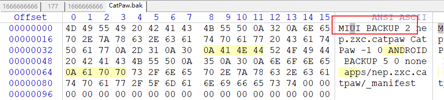

> 对apk进行分析,跳转到加密代码,通过分析代码,发现只需要最后的md5值和8b9b0ad9c324204fac87ae0fc2c630bd相等即可

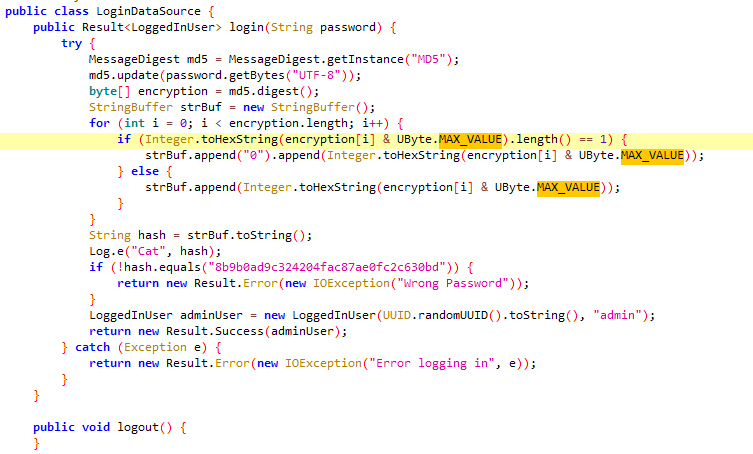

> 同时资源中又发现password必须大于5位

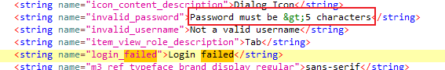

> 一开始的想法是hook上面的方法,认为通过验证后能拿到flag,脚本如下

```java
setImmediate(function() {
Java.perform(function() {
	var targetClass='nep.zxc.catpaw.data.LoginDataSource';
	var methodName='login';
	var gclass = Java.use(targetClass);
	gclass[methodName].overload("java.lang.String").implementation = function(arg0) {
		var loginUser = Java.use("nep.zxc.catpaw.data.model.LoggedInUser").$new("12345","admin");
		//hook内部类
    var resultClass = Java.use("nep.zxc.catpaw.data.Result$Success");
		var ret = resultClass.$new(loginUser);
		return ret;
	}
})
})
```

> hook之后是直接显示通过,并没有给出flag


> 之后在so中发现读取/dev/input/event1并保存在应用目录下

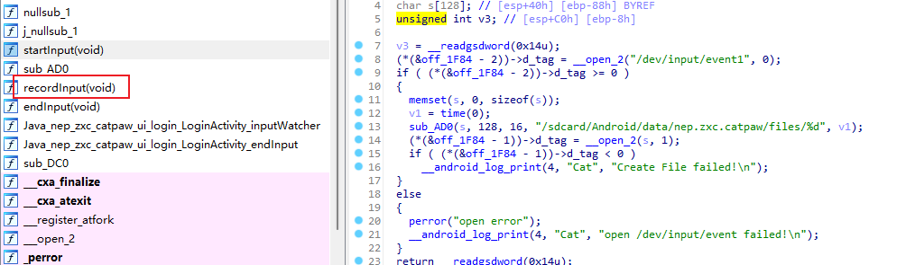

> 备份文件中的数据文件就是保存下来的输入数据


> 利用命令即可模拟输入

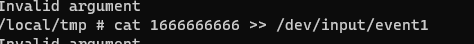

> 一次输入是CatC,大概是因为输入的时候报错了,我的手机并不是小米手机,只是刷了MIUI系统,可能是这个原因导致报错,没有全部输入完成


> 转换思路,通过阅读文章https://blog.seeflower.dev/archives/45/,发现可以分析文件指令,先通过命令getevent -lt /dev/input/event1和命令cat 1666666666 >> /dev/input/event1可以抓取文件未报错部分的信息

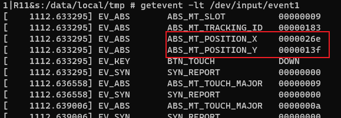

> 可以看到上图中按下的坐标值,根据坐标值搜索文件的16进制数据,可以发现两个指令,指令03003500代表X轴,指令03003600代表Y轴

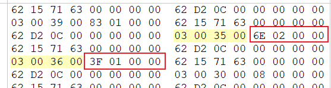

> 依次写出脚本提取所有的坐标

```python
def get_x(v):
    x = []
    for i in range(4):
        tmp = str(hex(v[i+4]))[2:]
        if len(tmp) == 1:
            tmp = "0" + tmp
        x.append(tmp)
    x.reverse()
    ret = ""
    for v in x:
        ret += v
    return int(ret,16)

def get_y(v):
    y = []
    for i in range(4):
        tmp = str(hex(v[i+4]))[2:]
        if len(tmp) == 1:
            tmp = "0" + tmp
        y.append(tmp)
    y.reverse()
    ret = ""
    for v in y:
        ret += v
    return int(ret,16)

def is_y(v):
    if v[0] == 0x03 and v[1] == 0x00 and v[2] == 0x36 and v[3] == 0x00:
        return True
    return False

def is_x(v):
    if v[0] == 0x03 and v[1] == 0x00 and v[2] == 0x35 and v[3] == 0x00:
        return True
    return False

with open("1666666666","rb") as fr:
    rd = fr.read()
for i in range(16,len(rd),24):
    v = rd[i:i+8]
    x = 0
    y = 0
    if is_x(v):
        x = get_x(v)
        print(x,end=",")
    if is_y(v):
        y = get_y(v)
        print(y)
# 622,319
# 83,1901
# 472,1904
# 81,1892
# 133,1739
# 493,1603
# 62,1892
# 443,502,1601
# 450,1755
# 97,1903
# 107,2064
# 293,1622
# 487,1620
# 635,1751
# 271,1601
# 83,2086
# 1011,1626
# 65,1919
# 453,1913
# 386,1438
# 500,1588
# 84,2021
# 1015,1630
# 87,2074
# 465,1902
# 489,1446
# 90,2042
# 1028,1611
# 77,1897
# 417,1599
# 77,1903
# 286,1613
# 438,1912
# 1032,1491
# 388,1615
# 325,1758
# 804,1623
# 82,1895
# 765,1908
# 920,1464
# 76,2056
# 1016,1635
# 89,2060
# 769,1763
# 431,1912
# 385,1614
# 290,1435
# 1437
# 756,1933
# 95,2051
# 1021,1647
# 648,1906
# 593,1597
# 86,2069
# 1029,1649
# 817,1615
# 767,1899
# 83,1919
# 1043,1643
# 79,1909
# 715,1611
# 492,1625
# 89,2090
# 1040,1632
# 289,1607
# 542,1918
# 81,1935
# 292,1580
# 80,1909
# 756,1922
# 711,1466
# 83,2021
# 392,1605
# 587,781
```

> 提取的数据中出现两个问题,可以看到少了两条数据,443没有对应的Y轴,1437没有对应的X轴


> 干脆先把两者互补一下,都是443,1437,利用adb进行模拟点击

```
adb shell input tap 622 319
adb shell input tap 83 1901
adb shell input tap 472 1904
adb shell input tap 81 1892
adb shell input tap 133 1739
adb shell input tap 493 1603
adb shell input tap 62 1892
adb shell input tap 443 1437
adb shell input tap 502 1601
adb shell input tap 450 1755
adb shell input tap 97 1903
adb shell input tap 107 2064
adb shell input tap 293 1622
adb shell input tap 487 1620
adb shell input tap 635 1751
adb shell input tap 271 1601
adb shell input tap 83 2086
adb shell input tap 1011 1626
adb shell input tap 65 1919
adb shell input tap 453 1913
adb shell input tap 386 1438
adb shell input tap 500 1588
adb shell input tap 84 2021
adb shell input tap 1015 1630
adb shell input tap 87 2074
adb shell input tap 465 1902
adb shell input tap 489 1446
adb shell input tap 90 2042
adb shell input tap 1028 1611
adb shell input tap 77 1897
adb shell input tap 417 1599
adb shell input tap 77 1903
adb shell input tap 286 1613
adb shell input tap 438 1912
adb shell input tap 1032 1491
adb shell input tap 388 1615
adb shell input tap 325 1758
adb shell input tap 804 1623
adb shell input tap 82 1895
adb shell input tap 765 1908
adb shell input tap 920 1464
adb shell input tap 76 2056
adb shell input tap 1016 1635
adb shell input tap 89 2060
adb shell input tap 769 1763
adb shell input tap 431 1912
adb shell input tap 385 1614
adb shell input tap 290 1435
adb shell input tap 443 1437
adb shell input tap 756 1933
adb shell input tap 95 2051
adb shell input tap 1021 1647
adb shell input tap 648 1906
adb shell input tap 593 1597
adb shell input tap 86 2069
adb shell input tap 1029 1649
adb shell input tap 817 1615
adb shell input tap 767 1899
adb shell input tap 83 1919
adb shell input tap 1043 1643
adb shell input tap 79 1909
adb shell input tap 715 1611
adb shell input tap 492 1625
adb shell input tap 89 2090
adb shell input tap 1040 1632
adb shell input tap 289 1607
adb shell input tap 542 1918
adb shell input tap 81 1935
adb shell input tap 292 1580
adb shell input tap 80 1909
adb shell input tap 756 1922
adb shell input tap 711 1466
adb shell input tap 83 2021
adb shell input tap 392 1605
adb shell input tap 587 781
```

> 本次点击的效果如下,很明显不符合flag的形式,其次是443,1437,显示的是5,第一个5显而易见是C,将坐标改成C的坐标即可

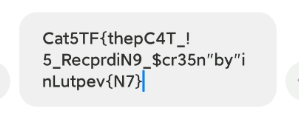

> 然而即使是CatCTF{thepC4T_!5_RecprdiN9_$cr35n"by"inLutpev{N7},那也很奇怪了,并且md5校验不通过

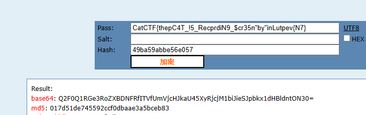

> 通过打开安卓的触控指针位置并进行录屏,对每次点击的位置进行分析


> 利用PotPlayer对视频进行逐帧分析,发现每次点击都在键盘偏下的位置,因此需要减少Y轴的值,通过不断调试,发现减少25最为合适

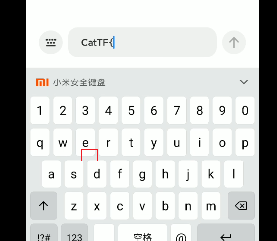

> 同时注意到了1437这个没有X坐标的值,这个高度位于数字区,也就是说如果5不正确,最多再试9次,依旧能获得正确的值,修改后代码如下

```python
def get_x(v):
    x = []
    for i in range(4):
        tmp = str(hex(v[i+4]))[2:]
        if len(tmp) == 1:
            tmp = "0" + tmp
        x.append(tmp)
    x.reverse()
    ret = ""
    for v in x:
        ret += v
    return int(ret,16)

def get_y(v):
    y = []
    for i in range(4):
        tmp = str(hex(v[i+4]))[2:]
        if len(tmp) == 1:
            tmp = "0" + tmp
        y.append(tmp)
    y.reverse()
    ret = ""
    for v in y:
        ret += v
    return int(ret,16)

def is_y(v):
    if v[0] == 0x03 and v[1] == 0x00 and v[2] == 0x36 and v[3] == 0x00:
        return True
    return False

def is_x(v):
    if v[0] == 0x03 and v[1] == 0x00 and v[2] == 0x35 and v[3] == 0x00:
        return True
    return False

with open("1666666666","rb") as fr:
    rd = fr.read()
for i in range(16,len(rd),24):
    v = rd[i:i+8]
    x = 0
    y = 0
    if is_x(v):
        x = get_x(v)
        print(x,end=",")
    if is_y(v):
        y = get_y(v)
        print(y-25)
```

> 修改后的脚本如下

```
adb shell input tap 622 294
adb shell input tap 83 1876
adb shell input tap 472 1879
adb shell input tap 81 1867
adb shell input tap 133 1714
adb shell input tap 493 1578
adb shell input tap 62 1867
adb shell input tap 472 1879
adb shell input tap 502 1576
adb shell input tap 450 1730
adb shell input tap 97 1878
adb shell input tap 107 2039
adb shell input tap 293 1597
adb shell input tap 487 1595
adb shell input tap 635 1726
adb shell input tap 271 1576
adb shell input tap 83 2061
adb shell input tap 1011 1601
adb shell input tap 65 1894
adb shell input tap 453 1888
adb shell input tap 386 1413
adb shell input tap 500 1563
adb shell input tap 84 1996
adb shell input tap 1015 1605
adb shell input tap 87 2049
adb shell input tap 465 1877
adb shell input tap 489 1421
adb shell input tap 90 2017
adb shell input tap 1028 1586
adb shell input tap 77 1872
adb shell input tap 417 1574
adb shell input tap 77 1878
adb shell input tap 286 1588
adb shell input tap 438 1887
adb shell input tap 1032 1466
adb shell input tap 388 1590
adb shell input tap 325 1733
adb shell input tap 804 1598
adb shell input tap 82 1870
adb shell input tap 765 1883
adb shell input tap 920 1439
adb shell input tap 76 2031
adb shell input tap 1016 1610
adb shell input tap 89 2035
adb shell input tap 769 1738
adb shell input tap 431 1887
adb shell input tap 385 1589
adb shell input tap 290 1410
adb shell input tap 443 1412
adb shell input tap 756 1908
adb shell input tap 95 2026
adb shell input tap 1021 1622
adb shell input tap 648 1881
adb shell input tap 593 1572
adb shell input tap 86 2044
adb shell input tap 1029 1624
adb shell input tap 817 1590
adb shell input tap 767 1874
adb shell input tap 83 1894
adb shell input tap 1043 1618
adb shell input tap 79 1884
adb shell input tap 715 1586
adb shell input tap 492 1600
adb shell input tap 89 2065
adb shell input tap 1040 1607
adb shell input tap 289 1582
adb shell input tap 542 1893
adb shell input tap 81 1910
adb shell input tap 292 1555
adb shell input tap 80 1884
adb shell input tap 756 1897
adb shell input tap 711 1441
adb shell input tap 83 1996
adb shell input tap 392 1580
adb shell input tap 587 756
```

> 本次运行效果如下,这次就有点像样了,不过这串的md5值还是不匹配

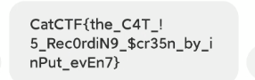

> 那很简单了,将$cr35n的5用其他数字进行替换,最终在替换为3时,md5值成功匹配

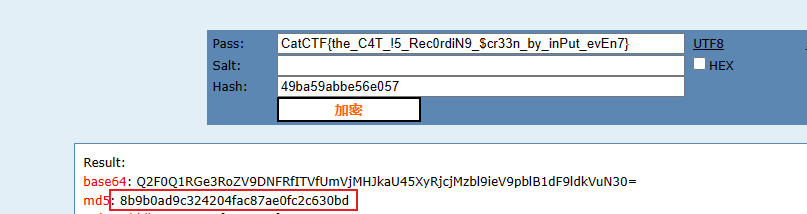

> 在app中进行验证,成功攻破


## flag

> CatCTF{the_C4T_!5_Rec0rdiN9_$cr33n_by_inPut_evEn7}

## 参考

> https://www.cnblogs.com/WXjzc/p/17020205.html
