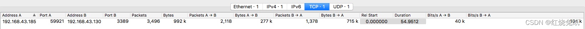
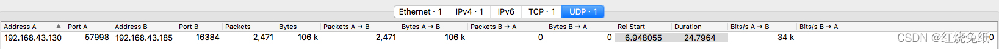
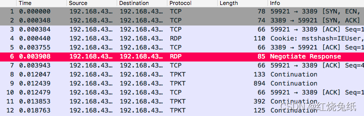
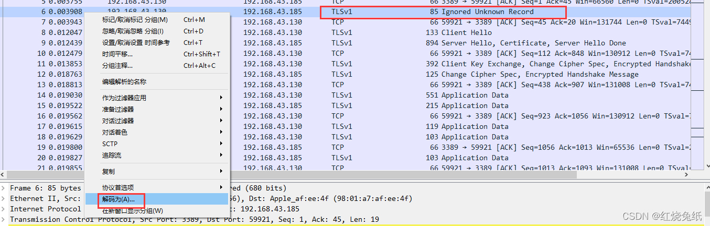
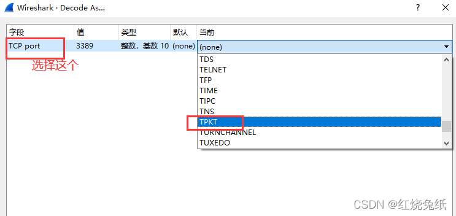
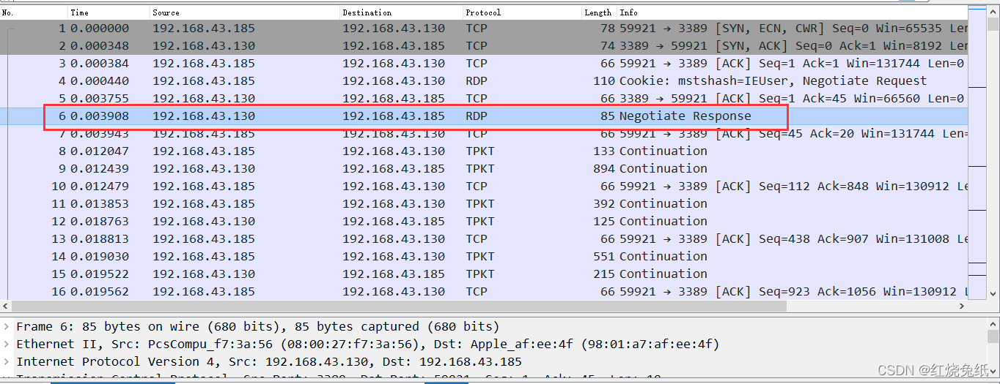
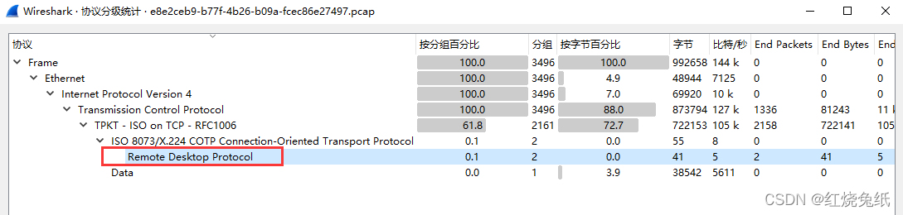
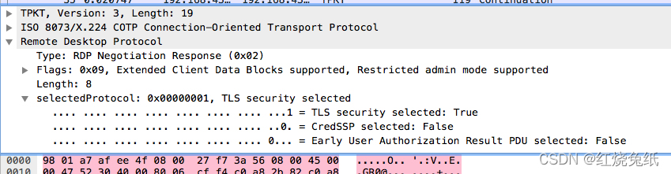
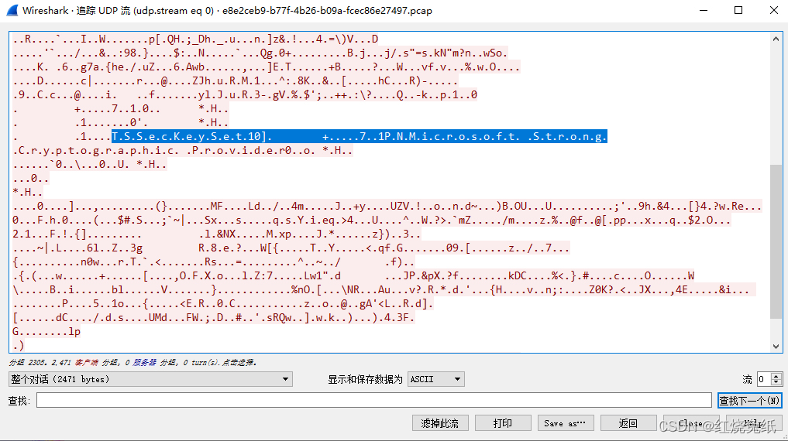

# Arrdeepee

## 解题思路

> 下载附件得到一个流量包文件,过滤所有http协议的数据包,没有http协议类型的数据包,看来是其他的协议了.

> PCAP文件中有两个不同的流：UDP流和TCP流




> 当分析流量的开始时,可以看到TCP流包含RDP数据.如果在打开PCAP文件时没有显示出来,则将TCP通信解码为TPKT.






> 此时,会发现所有的TLSv1都变成了TPTK,且：



> RDP一般指远程桌面协议,另外,注意到RDP流量是通过SSL加密的,如下所示：



> 由此,可以猜测需要重播RDP会话,但为此,需要找到用于解密通信的密钥.这可能在UDP流中.跟随UDP流,看到大量的二进制数据,其中包含一些有趣的字符串.“ TSSecKeySet1”和“ Microsoft Strong Cryptographic Provider”看起来像是对要查找的加密货币的非常有趣的引用.



> 可以将整个流转储到文件中并尝试对其进行分析.首先,让看看它是否可以识别为文件：

```

$ file extracted_data.bin
 
extracted_data.bin: data
```

> 似乎没有可识别的标头.因此,让尝试在其上运行binwalk：

```

$ binwalk -e extracted_data.bin
 
DECIMAL       HEXADECIMAL     DESCRIPTION
--------------------------------------------------------------------------------
30            0x1E            Certificate in DER format (x509 v3), header length: 4, sequence length: 2376
57            0x39            Certificate in DER format (x509 v3), header length: 4, sequence length: 1466
1546          0x60A           Private key in DER format (PKCS header length: 4, sequence length: 860
```

> 现在,它似乎包含一些证书和一个私钥.尝试将单个文件转换为可以使用openssl读取的纯文本格式似乎没有用.可以通过将其读取为ASN.1来对其进行调试.

```
$ openssl asn1parse -inform DER -in extracted_data.bin
    0:d=0  hl=4 l=2467 cons: SEQUENCE
    4:d=1  hl=2 l=   1 prim: INTEGER           :03
    7:d=1  hl=4 l=2399 cons: SEQUENCE
   11:d=2  hl=2 l=   9 prim: OBJECT            :pkcs7-data
   22:d=2  hl=4 l=2384 cons: cont [ 0 ]
   26:d=3  hl=4 l=2380 prim: OCTET STRING      [HEX DUMP]:省略
 2410:d=1  hl=2 l=  59 cons: SEQUENCE
 2412:d=2  hl=2 l=  31 cons: SEQUENCE
 2414:d=3  hl=2 l=   7 cons: SEQUENCE
 2416:d=4  hl=2 l=   5 prim: OBJECT            :sha1
 2423:d=3  hl=2 l=  20 prim: OCTET STRING      [HEX DUMP]:C6636BA1DC7A4063D2AD49F7DBB800AD92260253
 2445:d=2  hl=2 l=  20 prim: OCTET STRING      [HEX DUMP]:9BADF56CE6069E1EB9339E0E9FCD096ACD0DBC5B
 2467:d=2  hl=2 l=   2 prim: INTEGER           :07D0
```

> 得到了大量的数据.但是,由于该结构可以包含嵌套数据,因此可以通过指定要解码的八位位组字符串来进行向下钻取.

```

$ openssl asn1parse -inform DER -in extracted_data.bin -strparse 26
    0:d=0  hl=4 l=2376 cons: SEQUENCE
    4:d=1  hl=4 l=1489 cons: SEQUENCE
    8:d=2  hl=2 l=   9 prim: OBJECT            :pkcs7-data
   19:d=2  hl=4 l=1474 cons: cont [ 0 ]
   23:d=3  hl=4 l=1470 prim: OCTET STRING      [HEX DUMP]:省略
 1501:d=2  hl=2 l=   9 prim: OBJECT            :pkcs7-encryptedData
 1512:d=2  hl=4 l= 864 cons: cont [ 0 ]
 1516:d=3  hl=4 l= 860 cons: SEQUENCE
 1520:d=4  hl=2 l=   1 prim: INTEGER           :00
 1523:d=4  hl=4 l= 853 cons: SEQUENCE
 1527:d=5  hl=2 l=   9 prim: OBJECT            :pkcs7-data
 1538:d=5  hl=2 l=  28 cons: SEQUENCE
 1540:d=6  hl=2 l=  10 prim: OBJECT            :pbeWithSHA1And40BitRC2-CBC
 1552:d=6  hl=2 l=  14 cons: SEQUENCE
 1554:d=7  hl=2 l=   8 prim: OCTET STRING      [HEX DUMP]:135DB999CA2CD6B1
 1564:d=7  hl=2 l=   2 prim: INTEGER           :07D0
 1568:d=5  hl=4 l= 808 prim: cont [ 0 ]
```

> 同样,让​​对嵌套结构进行解码.

```
$ openssl asn1parse -inform DER -in extracted_data.bin -strparse 26 -strparse 23
    0:d=0  hl=4 l=1466 cons: SEQUENCE
    4:d=1  hl=4 l=1462 cons: SEQUENCE
    8:d=2  hl=2 l=  11 prim: OBJECT            :pkcs8ShroudedKeyBag
   21:d=2  hl=4 l=1270 cons: cont [ 0 ]
   25:d=3  hl=4 l=1266 cons: SEQUENCE
   29:d=4  hl=2 l=  28 cons: SEQUENCE
   31:d=5  hl=2 l=  10 prim: OBJECT            :pbeWithSHA1And3-KeyTripleDES-CBC
   43:d=5  hl=2 l=  14 cons: SEQUENCE
   45:d=6  hl=2 l=   8 prim: OCTET STRING      [HEX DUMP]:66AFD4385D4302C4
   55:d=6  hl=2 l=   2 prim: INTEGER           :07D0
   59:d=4  hl=4 l=1232 prim: OCTET STRING      [HEX DUMP]:省略
 1295:d=2  hl=3 l= 172 cons: SET
 1298:d=3  hl=2 l=  13 cons: SEQUENCE
 1300:d=4  hl=2 l=   9 prim: OBJECT            :Microsoft Local Key set
 1311:d=4  hl=2 l=   0 cons: SET
 1313:d=3  hl=2 l=  19 cons: SEQUENCE
 1315:d=4  hl=2 l=   9 prim: OBJECT            :localKeyID
 1326:d=4  hl=2 l=   6 cons: SET
 1328:d=5  hl=2 l=   4 prim: OCTET STRING      [HEX DUMP]:01000000
 1334:d=3  hl=2 l=  39 cons: SEQUENCE
 1336:d=4  hl=2 l=   9 prim: OBJECT            :friendlyName
 1347:d=4  hl=2 l=  26 cons: SET
 1349:d=5  hl=2 l=  24 prim: BMPSTRING
 1375:d=3  hl=2 l=  93 cons: SEQUENCE
 1377:d=4  hl=2 l=   9 prim: OBJECT            :Microsoft CSP Name
 1388:d=4  hl=2 l=  80 cons: SET
 1390:d=5  hl=2 l=  78 prim: BMPSTRING
```

> 这实际上看起来像是PKCS12文件,捆绑证书的存档格式和私钥.可以从中提取私钥：

```
$ openssl pkcs12 -in extracted_data.bin -nocerts -nodes -out private.key
Enter Import Password: mimikatz
MAC verified OK
```

> 猜到了证书文件的密码“ mimikatz”,但可以在此处获取有关信息.获取私钥后,可以使用一个称为RDP-Replay的工具 来重播RDP会话,并找出攻击者在入侵期间正在做什么.编译后,可以运行rdp_replay带有选项的可执行文件,以保存攻击者按下的键,并将捕获到的剪贴板事件中的数据转储到文件中.另外,将重播的视频保存到文件中.

```
$ rdp_replay -r ../e8e2ceb9-b77f-4b26-b09a-fcec86e27497.pcap -o recording.avi -p ./private.key --save_clipboard --show_keys > output
```

> 他的工作是使用未显示给用户的密码压缩和加密标志文件,然后将base64编码并复制到剪贴板.这就是为什么必须保存键入的键和剪贴板事件信息的原因.输入的键记录

```
RDP SSL MODE Requested by server!!
SSL private key found.
1024x756x8
REALLY DELICIOUS PANCAKES<Tab>REALLY DELICIOUS PANCAKES
```

> 剪切板的内容
```
N3q8ryccAATjAlOVMAAAAAAAAABqAAAAAAAAACmoQ4fA1DQXZvCzJGIg/8cxnh8QXnWoDkwNxjGL
37P7rvVC2SMn8+wquEv/A5HBL9djQewBBAYAAQkwAAcLAQACJAbxBwEKUweBdxD1DDirkCEhAQAB
AAwrJwAICgGwcALcAAAFARkJAAAAAAAAAAAAERMAZgBsAGEAZwAuAHQAeAB0AAAAGQAUCgEAAFNu
lssb0wEVBgEAIAAAAAAA
```

> 放在一起：
```
$ cat ../clip-00000000-down | base64 -d -i > flag.7z
$ 7z x flag.7z
 
7-Zip [64] 9.20  Copyright (c) 1999-2010 Igor Pavlov  2010-11-18
p7zip Version 9.20 (locale=en_US.UTF-8,Utf16=on,HugeFiles=on,2 CPUs)
 
Processing archive: flag.7z
 
 
Enter password (will not be echoed) :
Extracting  flag.txt
 
Everything is Ok
 
Size:       39
Compressed: 186
$ cat flag.txt

```


## flag

> HITB{44519a67ffc654e40febc09e20e8e745}

## 参考

> https://blog.csdn.net/weixin_39934520/article/details/122014291
