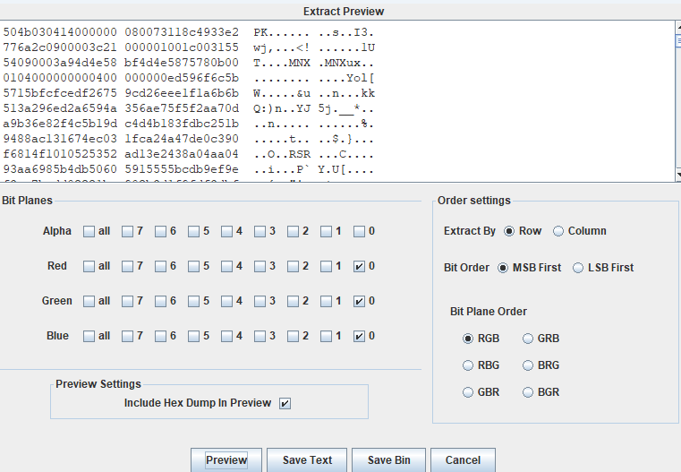

# misc_pic_again

## 解题思路

> 用binwalk查看文件,发现存在部分数据为zip.使用Stegsolve.jar选择图片,选择Data Extract,然后选择如下:

> Save bin,保存的文件修改为.zip格式,解压得到一个文件,用010 Editor打开发现是elf文件,在kali中执行strings 1 | grep "hctf"得到flag.

## flag

> hctf{scxdc3tok3yb0ard4g41n~~~}
