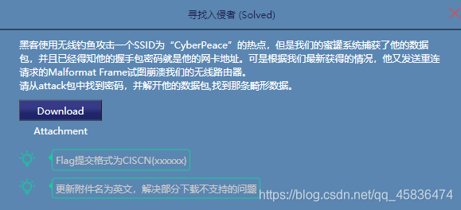
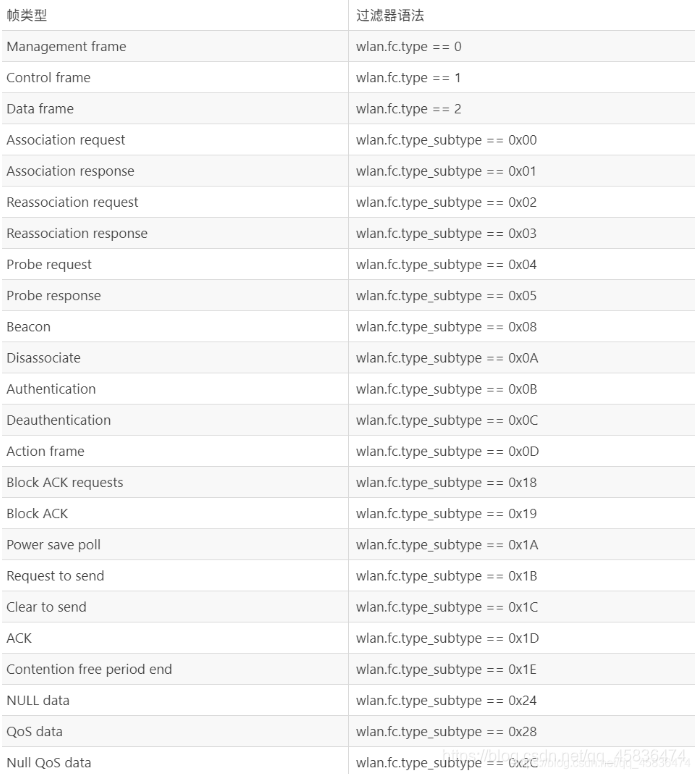
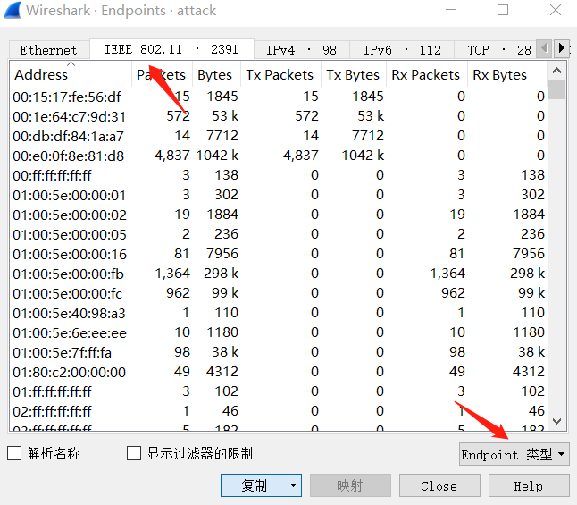

# 寻找入侵者

## 解题思路

> 下载附件,得到2个pcapng文件,打开是无线流量包,题目描述如下:



> 打开wireshark,导入该数据包,可以看到很多的数据,wireshark中无线帧的类型和过滤规则对照表



> 在wireshark的操作如下：统计 –> 端点,打开后在Endpoint类型里勾上IEEE 802.11,就能出现如下画面：



>  然后点击复制–>作为CSV就能将所有的mac地址提取出来,然后通过利用aircrack-ng工具(kali自带)得到密码为88:25:93:c1:c8:eb

```
aircrack-ng hanshake.cap -w 1.txt
```

> 解密流量包

```
airdecap-ng -p 88:25:93:c1:c8:eb -e Honey hanshake.cap
```

> 打开解密后的流量包,过滤下http协议的流量,发现请求了key.rar,下载解压发现key.pcap文件,使用Omnipeek双击打开既然提示打不开,使用wireshark正常打开后,根据题目提到攻击者向无线路由器发送了重连请求,使用wlan.sa == 88:25:93:c1:c8:eb显示过滤后发现攻击者MAC 88:25:93:c1:c8:eb有一个请求是发给AP ESSID为CyberPeace 下的38:37:8b:9b:29:3c,提交flag

## flag

> CISCN{Z9DY20jZIyjzY5vs0UQZVUg86eMYlNMzH}

> 攻防世界上的答案是错误的,攻防世界上的答案为CISCN{4qgVp9ufsXMpODy2YZada27J1ZNLVjKmB}

## 参考

> https://blog.csdn.net/qq_45836474/article/details/112412259

> https://www.jianshu.com/p/04ef45f4b243

> https://www.wireshark.org/tools/wpa-psk.html
