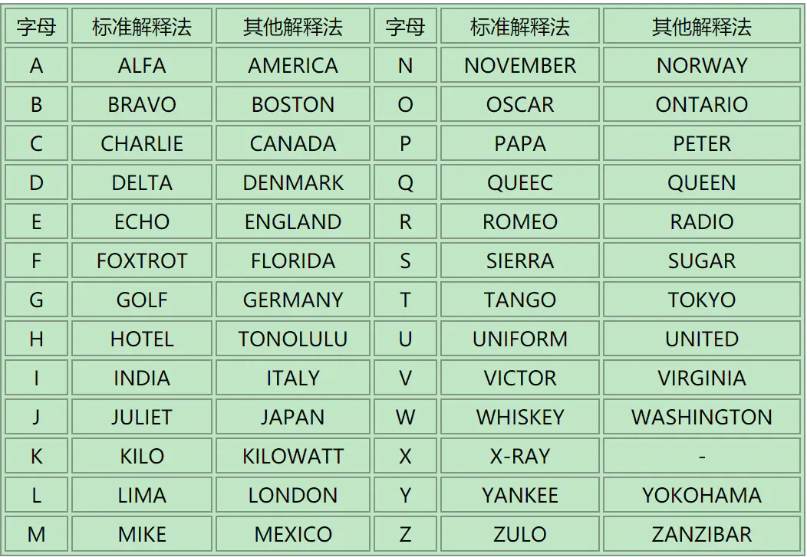

# 我们生活在南京-1

## 解题思路

> 下载附件得到一个mp3文件,将这个音频反转一下,

```
pip install pydub
pip install pyaudio

from pydub import AudioSegment
from pydub.playback import play

#读取想要倒放的音频文件 
ted = AudioSegment.from_file("nanjing_1.mp3")
#将音频倒转
backwards = ted.reverse()
#保存倒放的音频
backwards.export("nanjing_2.mp3")
#播放倒放文件 
play(backwards)
```

> 参考业余无线电通联常用的字母解释法：可以得到radiowavesacrosstime



## flag

> flag{radiowavesacrosstime}
