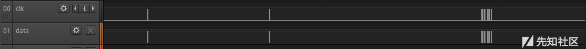
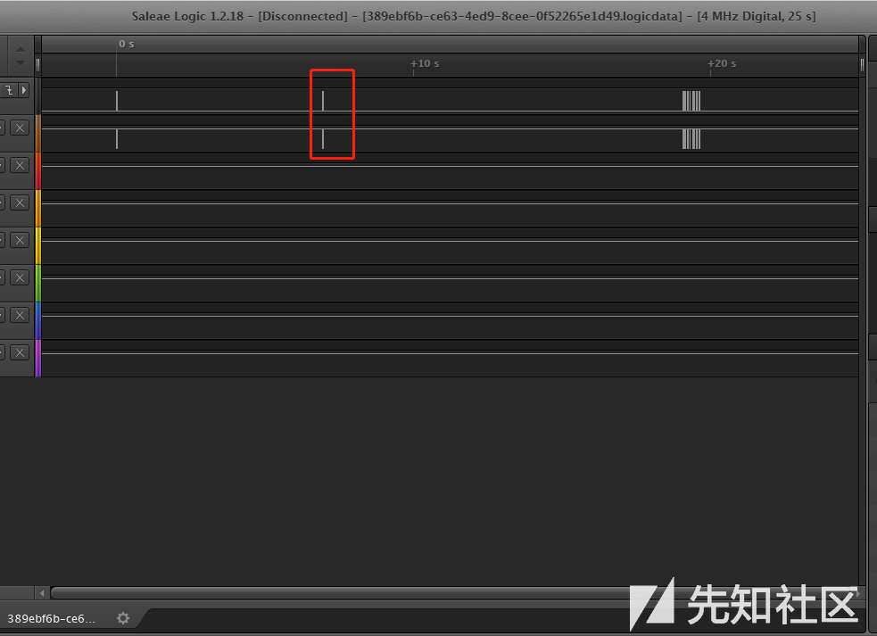
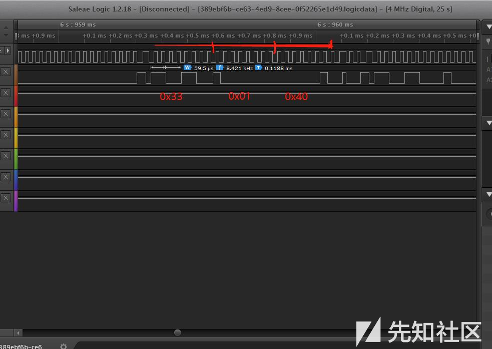
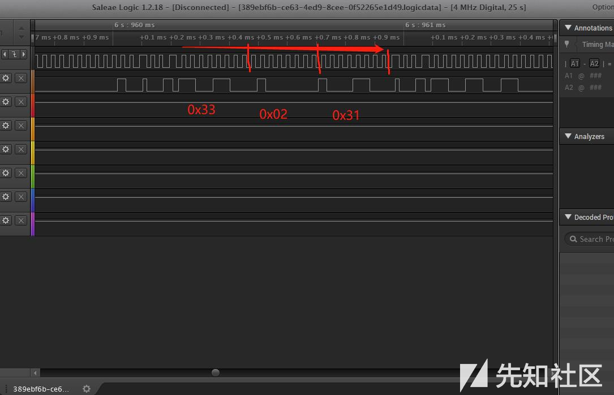

# 神秘的交易

## 解题思路

> 下载附件得到一个logicdata文件

> 下载Saleae Logic 分析软件分析截获的logicdata数据包：



> clk栏为时钟电平,data栏为数据电平.每个指令都在时钟高电平时数据下降沿后开始,数据从低位到高位的顺序发送.发送的命令格式为 一个字节指令类型 一个字节地址 一个字节数据,然后时钟高电平数据电平上升沿代表本次命令结束.我们关注的指令类型为0x33,用于校验口令.发送命令格式为:

```
0x33 0x01 s1
0x33 0x02 s2
0x33 0x03 s3
```

> 其中s1 s2 s3拼在一起就是那三个字节的口令了.在下图方框部分可以找到校验口令：



> 放大后三条命令分别为：





> 时钟电平为高电平时对应的数据电平高低位分别表示1和0,且数据按从低位到高位的顺序发送,因此三条指令分别为：

```
0x33 0x01 0x40
0x33 0x02 0x31
0x33 0x03 0x10
```

> 因此三个口令为 0x40 0x31 0x10

## flag

> SCTF{403110}