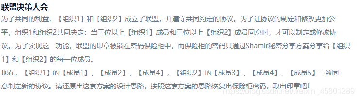

# 联盟决策大会

## 解题思路

> 下载文件得到一个txt文本,里面是一些乱码和数字.

> 题目描述为:

> 根据题目可知此处使用了shamir加密,使用脚本解密得flag

## flag

> DDCTF{5x3ROxvqF2SJrDdVy73IADA04PxdLLab}

## 参考

> https://blog.csdn.net/weixin_45801289/article/details/118710387