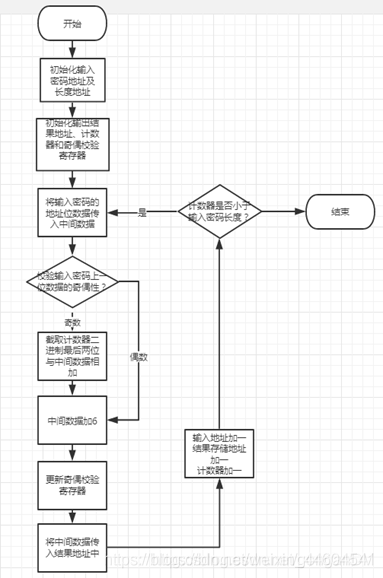
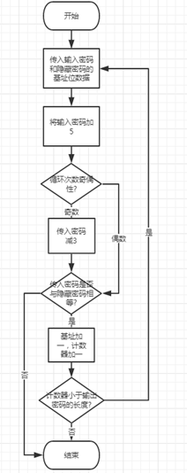

# Triangle

## 思路分析

> 打开网站是一个输入框页面,源码没信息,查看js部分,下载下来,找到了关键函数.这些函数都看不懂,,太难了,用的是unicorn框架仿真ARM!

> util.js 定义了get_pw()函数里用到的三个函数: stoh、htos、getBase64Image

> unicorn.js非常大,是JavaScript框架的源码,在secret.js中用于仿真ARM.

> 根据index.js函数login的思路,get_pw()应该输出一个固定值.enc_pw和test_pw函数仿真ARM，需要逆向了解它在干嘛,然后想办法满足登陆条件.

> 尝试直接在console输出get_pw(),得到XYzaSAAX_PBssisodjsal_sSUVWZYYYb,要逆向enc_pw和test_pw函数要先想办法得到16进制,再转换为ARM汇编,[工具地址](https://armconverter.com/?disasm)

> 逆向enc_pw,仿照enc_pw构造getARM1()函数,又其输出是10进制的数组,构造转换为16进制的函数toHexString()

```
function getARM1(){
  var x = stoh(atob(getBase64Image("frei")));
  var output = new Array();
  for(var i = 0; i < o2.length ; i++){
    output[i] = x[o2[i]];
  }
  return output;
} 

//Looking at o2, we observe that our output will be in integers. 
//Lets try converting them to hex values.

function toHexString(byteArray) {
  return Array.from(byteArray, function(byte) {
    return ('0' + (byte & 0xFF).toString(16)).slice(-2);
  }).join('')
}
```

> 输出toHexString(getARM1()),得到0800a0e10910a0e10a20a0e10030a0e30050a0e30040d0e5010055e30100001a036003e2064084e0064084e2015004e20040c1e5010080e2011081e2013083e2020053e1f2ffffba0000a0e30010a0e30020a0e30030a0e30040a0e30050a0e30060a0e30070a0e30090a0e300a0a0e3,转换为ARM,得到:

```
mov r0, r8		//r8根据secret.js，赋值了r=8192，在这里赋值给r0
mov r1, sb		//sb是静态基址寄存器，与r9同义，根据secret.js，赋值了m=12288，这里赋值给r1
mov r2, sl		//sl是堆栈限制寄存器，与r10同义，根据secret.js，赋值了输入e的长度，这里赋值给r2
mov r3, #0		//r3初始化为0
mov r5, #0		//r5初始化为0
ldrb r4, [r0]	//将存储器地址为R0的字节数据读入寄存器R4，并将R4的高24位清零，这里在rom中是0x14
cmp r5, #1		//将R5的值与1相减，结果存在标志位中
bne #0x28		//根据标志位的结果，判断R5与1是否相等，若不相等则跳转到0x28处
and r6, r3, #3	//将R3和3相与结果传入R6，相当于截取R3二进制最后两位传入R6
add r4, r4, r6	//将R4 与R6相加的结果传入R4
add r4, r4, #6	//R4加6，这里在rom中是0x28
and r5, r4, #1	//将R4和1相与的结果传入R5，若R4为偶数则R5=0反之R5=1
strb r4, [r1]	//将R4的低8位传入以R1为基址的存储器地址中
add r0, r0, #1	//R0加一
add r1, r1, #1	//R1加一
add r3, r3, #1	//R3加一
cmp r3, r2		//将R3与R2相减，结果存在标志位中
blt #0x14		//根据标志位的结果判断R3是否小于R2若小于则跳转到0x14处，即若计数器小于输入密码长度则继续循环
mov r0, #0		//这里往下都是清零
mov r1, #0
mov r2, #0
mov r3, #0
mov r4, #0
mov r5, #0
mov r6, #0
mov r7, #0
mov sb, #0
mov sl, #0
```

> 类似逆向test_pw

```
function getARM2(){
  var x = stoh(atob(getBase64Image("eye")));
  var output = new Array();
  for(var i = 0; i < o1.length ; i++){
    output[i] = x[o1[i]];
  }
  return output;
} 
```

> 得到0900a0e10a10a0e10830a0e10040a0e30050a0e300c0a0e30020d0e50060d1e5056086e201c004e200005ce30000000a036046e2060052e10500001a010080e2011081e2014084e2030054e1f1ffffba0150a0e30000a0e30010a0e30020a0e30030a0e30040a0e30060a0e30070a0e30080a0e30090a0e300a0a0e300c0a0e3,转换为ARM,得到:

```
mov r0, sb		//向r0赋值m = 8192
mov r1, sl		//向r1赋值R = 12288
mov r3, r8		//向r3赋值输入值的长度
mov r4, #0		//初始化r4
mov r5, #0		//初始化r5
mov ip, #0		//初始化IP
ldrb r2, [r0]	//将存储器地址为R0的字节数据读入寄存器R2，并将R2的高24位清零，此处在rom中是0x18
ldrb r6, [r1]	//将存储器地址为R1的字节数据读入寄存器R6，并将R6的高24位清零
add r6, r6, #5	//将R6加5的结果传入R6
and ip, r4, #1	//将R4与1相与的结果传入IP
cmp ip, #0		//判断IP与0是否相等
beq #0x34		//如果IP==0，即R4是偶数，将会跳转到0x34处
sub r6, r6, #3	//else，即如果IP!=0，即R4是奇数，将R6减3的结果传入R6
cmp r2, r6		//判断R2与R6是否相等，此处在rom中是0x34
bne #0x54		//如果R2与R6不相等则跳转到0x54
add r0, r0, #1	//R0加一
add r1, r1, #1	//R1加一
add r4, r4, #1	//R4加一
cmp r4, r3		//比较R4与R3的大小
blt #0x18		//如果R4小于R3则跳转到0x18
mov r5, #1		//设置r5为1
mov r0, #0		//这里往下都是清零，此处在rom中是0x54
mov r1, #0
mov r2, #0
mov r3, #0
mov r4, #0
mov r6, #0
mov r7, #0
mov r8, #0
mov sb, #0
mov sl, #0
mov ip, #0
```

> enc_pw函数的流程如下:



> 用python表示就是

```
def enc_pw(e):
  res = ''
  f = 0
  for i, c in enumerate(e):
    c = ord(c)
    if f == 1:
      c += i & 3
    c += 6
    f = c & 1
    res += chr(c)
  return res
```

> test_pw函数的流程如下:




> 用python表示就是

```
def test_pw(e, t):
  for i, (c, d) in enumerate(zip(e, t)):
    c, d = ord(c), ord(d)
    c += 5
    if i & 1:
      c -= 3
    if c != d:
      return 0
  return 1
```

> 搞定了enc_pw和test_pw函数的python表示,那再搞个满足index里login的输入,逆着搞一下就是了

## payload

```
import string
def enc_pw(e):
  res = ''
  f = 0
  for i, c in enumerate(e):
    c = ord(c)
    if f == 1:
      c += i & 3
    c += 6
    f = c & 1
    res += chr(c)
  return res
  
encrypted = 'XYzaSAAX_PBssisodjsal_sSUVWZYYYb' # get_pw()的输出结果
flag = ''
# 逆向test_pw和index的login
for i, c in enumerate(encrypted):
  c = ord(c)
  c -= 5
  if i & 1:
    c += 3
  for d in string.printable:
    if enc_pw(flag + d)[i] == chr(c):
      flag += d
      break
  print flag
```

## flag

> flag{MPmVH94PTH7hhafgYahYaVfKJNLRNQLZ}

## 参考

> https://blog.csdn.net/weixin_44604541/article/details/109135115

> https://armconverter.com/?disasm